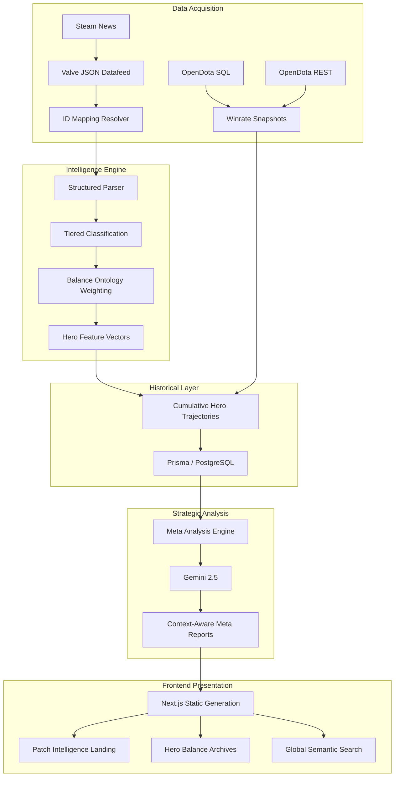

# Dota 2 Patch Intelligence

**Advanced contextual analytics for Dota 2 patch notes.**

Dota 2 Patch Intelligence is a high-fidelity data pipeline and visualization platform that transforms raw Dota 2 patch notes into machine-readable insights. It goes beyond simple quantitative changes to provide **Contextual Impact Analysis**, identifying synergistic meta shifts and evaluating how balance tweaks actually affect the competitive landscape.

---

## 🚀 Key Features

*   **Synergistic Meta Analysis:** Multi-LLM hybrid engine (Gemini 2.5 Flash) that identifies how systemic changes (economy, map) synergize with hero buffs to shift the meta.
*   **Net Balance Trajectory:** Tracks the cumulative power shifts of heroes across 7 strategic dimensions (Farming, Mobility, Teamfight, etc.) since patch 7.33.
*   **Empirical Truth Scores:** A built-in validation layer that compares AI predictions against actual post-patch winrate shifts, assigning an accuracy score to every analysis.
*   **Global Hero & Item Rosters:** Dedicated, searchable directories (`/heroes`, `/items`) with stylish backgrounds and cumulative balance trajectories.
*   **Temporal Intelligence:** The analysis engine considers previous patch states to determine if current changes are amplifying or correcting recent meta trends.
*   **Zero-Touch Automation:** A fully automated CI/CD pipeline that detects new patches, processes them, and deploys updates to the web without manual intervention.

---

## 🏗️ Architecture (v2.5)

The system uses a **Static-to-Dynamic Hybrid** architecture, combining the power of a relational database with the cost-efficiency of static hosting.

1.  **Ingestion Layer:** Discovers patches via Valve's official JSON datafeed and OpenDota SQL Explorer.
2.  **Intelligence Engine:** A tiered classification pipeline (Deterministic -> Semantic -> AI) that models balance changes into structured facts with **Partial Confidence** tagging.
3.  **Modeling Layer:** Calculates 7-dimensional **Hero Feature Vectors**, aggregates **Cumulative Balance Histories**, and tracks **Ontology Versions**.
4.  **Meta Analysis Layer:** A **Split-Prompt** LLM architecture that synthesizes high-level themes with **Temporal Context** and **Mechanical Grounding**.
5.  **Validation Layer:** A **Surgical Fact-Checker** that audits LLM outputs and calculates **Empirical Truth Scores** against post-patch winrate deltas.
6.  **Frontend:** A **Next.js** application optimized for **Static Site Generation (SSG)** with local-file failbacks for CI/CD robustness.

---

## 🛠️ Data Pipeline & CLI

The project operates as a multi-stage CLI-driven pipeline:

### Core Pipeline
For a step-by-step guide on how to process a new patch, see [Manual Patch Workflow](docs/MANUAL_PATCH_WORKFLOW.md).

1.  **Automation:** `npm run patch:auto -- <version>` — Triggers the unified orchestrator script.
2.  **Discovery:** `npm run patch:discovery` — Fetches raw data from Valve.
3.  **Parsing:** `npm run patch:parse` — Decomposes raw notes into structured facts with `originalSource` preservation.
4.  **Classification:** `npm run patch:classify` — Assigns polarity and confidence (System Estimates).
5.  **Intelligence:** `npm run patch:meta -- <version>` — Generates high-fidelity strategic summaries.
6.  **Audit:** `npm run patch:audit` — Calculates Empirical Truth Scores based on winrate deltas.

### Database & Serving
7.  **Seed Database:** `npm run db:seed` — Syncs all JSON intelligence into the local PostgreSQL database.
8.  **Backup DB:** `npm run db:backup` — Creates a Docker-aware SQL dump.
9.  **Start API:** `npm run dev --prefix apps/api` — Starts the Fastify server.
10. **Start UI:** `npm run dev --prefix apps/frontend` — Starts the Next.js dev server.

---

## 💻 Tech Stack

*   **Frontend:** Next.js (Static Export), TypeScript, Vanilla CSS (CSS Modules).
*   **API:** Fastify, Prisma ORM, PostgreSQL (via Docker).
*   **Intelligence:** Google Gen AI (Gemini 2.5), Valve Datafeed, OpenDota SQL.
*   **Deployment:** GitHub Actions, GitHub Pages.

---

## 📊 Data Flow

---

## 🗺️ Roadmap Status

- **Phases 1-13**: [COMPLETE] Foundation, Ingestion, Parsing, Vectors, Winrates, UI/UX, Local DB & API.
- **Phase 14**: [COMPLETE] Historical Backfill (Gemini 2.5 Truth-Grounded Re-run).
- **Phase 15**: [COMPLETE] Cross-Patch Trend Validation & Temporal Intelligence.
- **Phase 16**: [COMPLETE] Stratz Exit & OpenDota Migration.
- **Phase 18**: [COMPLETE] Mechanical Truth-Grounded Intelligence (Surgical Fact-Checking & Prompt Splitting).
- **Phase 19**: [COMPLETE] Empirical Meta Validation & Algorithm Tuning (Truth Scores).
- **Phase 20**: [COMPLETE] Zero-Touch Automation & CI/CD Pipeline.
- **Phase 17**: [FUTURE] Advanced Resilience & Data Sourcing.

---

## ⚖️ License
ISC License
