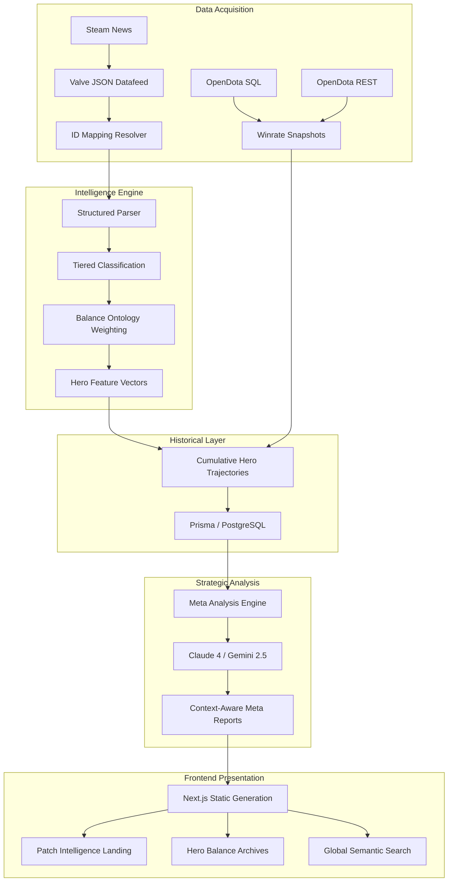

# Dota 2 Patch Intelligence

**Advanced contextual analytics for Dota 2 patch notes.**

Dota 2 Patch Intelligence is a high-fidelity data pipeline and visualization platform that transforms raw Dota 2 patch notes into machine-readable insights. It goes beyond simple quantitative changes to provide **Contextual Impact Analysis**, identifying synergistic meta shifts and evaluating how balance tweaks actually affect the competitive landscape.

---

## 🚀 Key Features

*   **Synergistic Meta Analysis:** Multi-LLM hybrid engine (Gemini 2.5 Flash & Claude 4 Sonnet) that identifies how systemic changes (economy, map) synergize with hero buffs to shift the meta.
*   **Net Balance Trajectory:** Tracks the cumulative power shifts of heroes across 7 strategic dimensions (Farming, Mobility, Teamfight, etc.) since patch 7.33.
*   **Historical Winrate Analytics:** Visualizes hero performance trends across multiple rank brackets (Herald to Divine) over the entire patch timeline.
*   **Role-Specific Winners & Losers:** Deep analytical breakdown of the top 3 heroes impacted by each patch for every role (Carry, Mid, Offlane, Soft Support, Hard Support).
*   **Temporal Intelligence:** The analysis engine considers previous patch states to determine if current changes are amplifying or correcting recent meta trends.
*   **High-Fidelity Grounding:** Strict mechanical rules ensure AI insights are competitively valid and factually grounded in Dota 2 mechanics.

---

## 🏗️ Architecture (v2.2)

The system uses a **Static-to-Dynamic Hybrid** architecture, combining the power of a relational database with the cost-efficiency of static hosting.

1.  **Ingestion Layer:** Discovers patches via Valve's official JSON datafeed and OpenDota SQL Explorer.
2.  **Intelligence Engine:** A tiered classification pipeline (Deterministic -> Semantic -> AI) that models balance changes into structured facts.
3.  **Modeling Layer:** Calculates 7-dimensional **Hero Feature Vectors** and aggregates **Cumulative Balance Histories**.
4.  **Meta Analysis Layer:** LLMs synthesize high-level themes with **Temporal Context** and **Mechanical Grounding**.
5.  **Serving Layer:** A local **Fastify API** and **PostgreSQL** database powered by **Prisma ORM**.
6.  **Frontend:** A **Next.js** application optimized for **Static Site Generation (SSG)** with local-file failbacks for CI/CD robustness.

---

## 🛠️ Data Pipeline & CLI

The project operates as a multi-stage CLI-driven pipeline:

### Core Pipeline
For a step-by-step guide on how to process a new patch, see [Manual Patch Workflow](docs/MANUAL_PATCH_WORKFLOW.md).

1.  **Ingestion:** `npm run patch:discovery` — Fetches raw data from Valve.
2.  **Mapping:** `npm run patch:mappings` — Builds ID-to-name maps.
3.  **Parsing:** `npm run patch:parse` — Decomposes raw notes into structured facts.
4.  **Vectors:** `npm run patch:vectors` — Calculates 7D identity shifts for heroes.
5.  **Winrates:** `npm run patch:fetch-winrates` — Syncs performance data from OpenDota (REST & SQL).
6.  **History:** `npm run patch:generate-history` — Builds cumulative hero identity archives.

### Intelligence Layer (LLM)
7.  **Meta Analysis:** `npm run patch:meta -- <version>` — Generates high-fidelity strategic summaries.
8.  **Historical Backfill:** `npm run patch:meta-backfill` — Runs the high-fidelity sequential re-analysis across the entire timeline.

### Database & Serving
9.  **Seed Database:** `npm run db:seed` — Syncs all JSON intelligence into the local PostgreSQL database.
10. **Start API:** `npm run dev --prefix apps/api` — Starts the Fastify server.
11. **Start UI:** `npm run dev --prefix apps/frontend` — Starts the Next.js dev server.

---

## 💻 Tech Stack

*   **Frontend:** Next.js (Static Export), TypeScript, Vanilla CSS (CSS Modules).
*   **API:** Fastify, Prisma ORM, PostgreSQL (via Docker).
*   **Intelligence:** Anthropic SDK (Claude 4), Google Gen AI (Gemini 2.5), Valve Datafeed, OpenDota SQL.
*   **Deployment:** GitHub Actions, GitHub Pages.

---

## 📊 Data Flow

---

## 🗺️ Roadmap Status

- **Phases 1-12**: [COMPLETE] Foundation, Ingestion, Parsing, Vectors, Winrates, UI/UX, Local DB & API.
- **Phase 14**: [COMPLETE] Historical Backfill (Initial High-Fidelity Run).
- **Phase 14.5**: [IN PROGRESS] Intuitive Meta Correction (Gemini Re-run).
- **Phase 15**: [UP NEXT] Cross-Patch Trend Validation & Temporal Intelligence.
- **Phase 16**: [FUTURE] Cloud Infrastructure & Dynamic Hosting Pivot.

---

## ⚖️ License
ISC License
