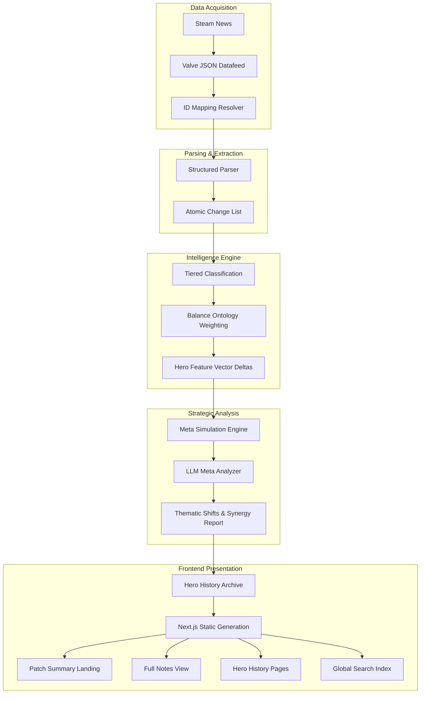

# Dota 2 Patch Intelligence

**Advanced contextual analytics for Dota 2 patch notes.**

Dota 2 Patch Intelligence is a high-fidelity data pipeline and visualization platform that transforms raw Dota 2 patch notes into machine-readable insights. It goes beyond simple quantitative changes to provide **Contextual Impact Analysis**, identifying synergistic meta shifts and evaluating how balance tweaks actually affect the competitive landscape.

---

## 🚀 Key Features

*   **Synergistic Meta Analysis:** Powered by LLMs (Gemini 2.5 Flash), the system identifies how systemic changes (economy, map) synergize with hero-specific buffs to shift the meta.
*   **Contextual Impact Scoring:** Evaluates the *actual weight* of changes against hero kits and game phases (Laning, Mid, Late), rather than just counting buffs/nerfs.
*   **Structured Parsing:** Automatically decomposes unstructured Valve patch strings into precise metrics (e.g., "Mana Cost", "Base Damage") with polarity detection.
*   **Thematic Insights:** Clear outlines of major gameplay shifts affecting specific roles and playstyles.
*   **Interactive Dashboard:** A filterable frontend built with Next.js and Vanilla CSS to browse winners, losers, and specific changes using a Dota-inspired palette.
*   **Official Data Source:** Consumes directly from the official Valve Datafeed API for 100% accuracy.

---

## 🏗️ Architecture

The system is built on a "Fact vs. Inference" separation principle, ensuring data integrity and explainable analysis.

1.  **Ingestion Layer:** Discovers patches via Steam News and fetches raw JSON from Valve.
2.  **Parsing Engine:** Resolves IDs (Heroes/Items/Abilities) and decomposes text into structured facts.
3.  **Classification Layer:** 
    *   *Quantitative:* Rule-based polarity detection (Buff/Nerf/Rework).
    *   *Qualitative:* LLM-driven contextual impact and magnitude scoring.
4.  **Meta Analysis Engine:** Synthesizes overarching thematic shifts and synergistic relationships.
5.  **Frontend Layer:** A static Next.js application designed for rapid browsing and deep-dive analysis.

---

## 🛠️ Data Pipeline

The project operates as a multi-stage CLI-driven pipeline:

1.  **Discovery:** `npm run patch:discovery` — Detects new patches on Steam and fetches the raw JSON datafeed.
2.  **Mapping:** `npm run patch:mappings` — Builds ID-to-name maps for heroes, abilities, and items from the Valve API.
3.  **Parsing:** `npm run patch:parse` — Decomposes raw notes into structured JSON changes with schema versioning.
4.  **Classification:** `npm run patch:classify` — Rule-based polarity detection.
5.  **Analytics:** `npm run patch:analyze` — Aggregates hero/item net scores for statistical summaries.
6.  **Meta Analysis:** `npm run patch:meta` — Single-call synergistic LLM analysis for deep strategic insights.
7.  **Impact Scoring:** `npm run patch:impact` — (Optional) Per-hero qualitative analysis.

---

## 💻 Tech Stack

*   **Frontend:** Next.js (Static Export), TypeScript, Vanilla CSS (CSS Modules).
*   **Pipeline:** Node.js, TypeScript, Google Gen AI SDK (Gemini).
*   **Deployment:** GitHub Actions, GitHub Pages.
*   **Data Format:** Hierarchical JSON (Transitioning to PostgreSQL).

---

## 📊 Data Flow & Analysis

---

## 🗺️ Roadmap

### Phase 1 — Foundation (Complete)
*   Establish project structure and core documentation.
*   Define initial architecture and data models.

### Phase 2 — Data Acquisition (Complete)
*   Automated ingestion from Valve JSON Datafeed.
*   Historical patch archival.

### Phase 3 — Parsing Engine (Complete)
*   Structured entity resolution and numerical change extraction.
*   Pipeline validation framework implemented.

### Phase 4 — Quantitative Classification (Complete)
*   Deterministic rule-based polarity detection (Buff/Nerf/Rework).

### Phase 5 — Contextual Impact & Thematic Analysis (Complete)
*   LLM-driven Synergistic Meta Analyzer for strategic insights.
*   Systemic impact evaluation (Economy/Map changes).

### Phase 6 — Frontend MVP (Complete)
*   Interactive dashboard with Dota-inspired styling.
*   Hero/Item lists with synergistic winners and losers.

### Phase 7 — CI/CD & Initial Deployment (Complete)
*   Automated build and deploy pipeline via GitHub Actions.
*   Site hosted on GitHub Pages.

### Phase 8 — Intelligence Foundation (Complete)
*   Tiered Classification Engine (Numeric/Semantic/Unknown).
*   Semantic & Balance Ontology matching.

### Phase 9 — Advanced Modeling (Complete)
*   Hero Feature Vectors (7D Identity Model).
*   Automatic vector modification based on patch notes.

### Phase 10 — Strategic Analytics (Complete)
*   Meta Impact Simulation (Draft-level reasoning).
*   Winrate Calibration loop for weight auto-tuning.

### Phase 11 — Frontend Polish & Advanced UX (Complete)
*   Dual-view patch architecture (Strategic Summary & Classic Notes).
*   Dedicated Hero History pages with trend visualization.
*   Global Cross-Patch Search.

### Phase 11.5 — UI/UX Refinement & Mobile Optimization (In Progress)
*   **Mobile Responsiveness:** Full dashboard optimization for small screens.
*   **Aesthetic Polish:** Fine-tuning colors, typography, and spacing.
*   **Additional Content:** New static pages (About, Glossary, etc.).

### Phase 12 — Backend API & Database Migration (Up Next)
*   Transition from local JSON files to PostgreSQL.
*   Node.js/Fastify API for dynamic data serving.

---

---

## ⚖️ License
ISC License
