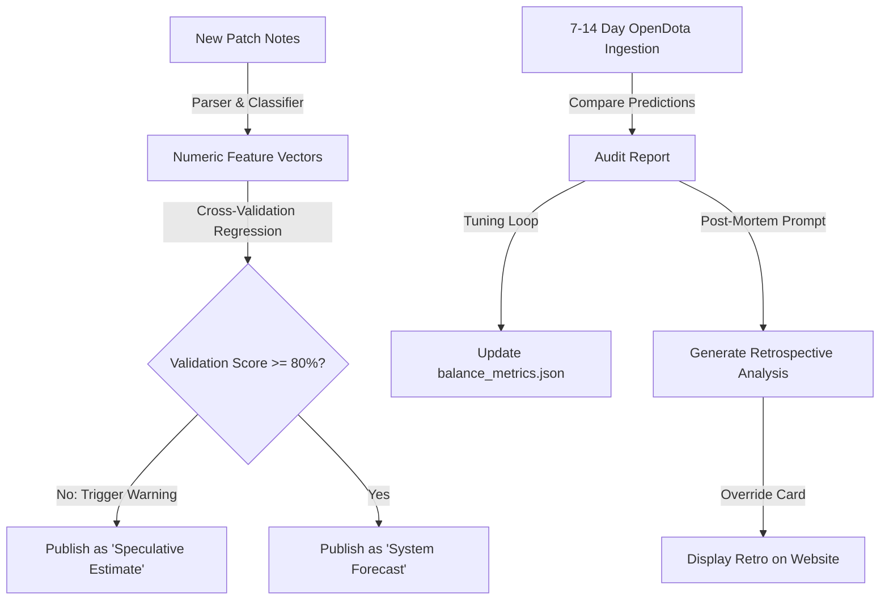

# Prediction Robustness & Validation Strategy

This document outlines the current weaknesses of the patch prediction model, the limitations of post-patch (ex post facto) validation, and our long-term plan to develop a stable, reliable, and self-correcting balance forecasting engine.

---

## 1. Current System Weaknesses

The current system relies on a hybrid pipeline: a deterministic rule engine (classification and feature vector deltas) coupled with a generative narrative simulator (Gemini). We have identified three core weaknesses:

### Weakness A: Ex Post Facto Validation Delay
We can only measure prediction accuracy after match statistics stabilize (7–14 days). On patch day, when user traffic is highest, the system's published predictions (e.g., "Synergistic Winners") are unverified. If a prediction is wrong, we cannot retrospectively prevent users from reading incorrect advice on day one.

### Weakness B: Winrate is a Lagging, Multi-Variable Indicator
A hero's winrate delta is a noisy signal. A hero may receive substantial buffs but see their winrate *decrease* due to:
- **Item Shifts**: Their core items were nerfed.
- **Counter-Meta**: Their natural counters were buffed even more, or became highly popular.
- **Pro Play Imitation**: High-pickrate heroes being picked by players who don't know how to play them, artificially depressing the public winrate.
- **Systemic Changes**: Economy or map changes that disadvantage their playstyle (e.g., camp layouts, creep gold).

Our current classification struggles to mathematically couple these variables when generating individual hero scores.

### Weakness C: Narrative Guesswork vs. Numerical Models
Currently, the LLM makes binary predictions (UP/DOWN) for the role and synergy lists, while the auto-tuner (`calibrateWeights.ts`) adjusts numerical metric weights. There is a decoupling between what the LLM predicts narratively and how the vector score is calculated, meaning the auto-tuner calibrates weights based on the numeric engine, but the frontend displays LLM guesses.

---

## 2. Long-Term Reliability Roadmap

To transition the platform into a stable and scientific balance forecaster, we will implement the following architectural changes:

### Phase I: Decoupled Narrative & Grounded Forecasts [COMPLETE]
*   **Item Affinity Mapping**: Implemented [item_hero_affinity.json](file:///c:/Users/Mats/Desktop/Coding%20Projects/Java%20Coding%20Projects/Project-001/dota-patch-intelligence/research-output/mappings/item_hero_affinity.json) and updated `calculateVectors.ts` to propagate 20% of direct item vector shifts to buyer heroes' vectors, resolving indirect item nerf/buff decoupling.
*   **Grounded Forecasts**: Predictions are generated by **Feature Vector deltas** combined with calibrated weights from `balance_metrics.json`.

### Phase II: Pre-Deployment Cross-Validation [COMPLETE]
Before a new patch goes live, the pipeline runs a **retroactive regression check**:
1. It simulates all historical patches (7.33 onwards) using the current balance weights.
2. We implemented `npm run patch:calibrate-safe` (`regressionGate.ts`) to automatically run this check and block calibrations that lower global accuracy below baseline.
3. If accuracy is validated, weights are merged; otherwise, they are safely reverted.

### Phase III: Automatic Post-Mortem Analysis
Instead of frozen wrong predictions showing a permanent red `❌`, we will implement an automatic retrospective rewrite after 14 days:
1. The system compares the initial prediction against the stabilized `GLOBAL_BLEND` winrate.
2. If the prediction is incorrect (e.g., Juggernaut was predicted to rise but dropped), the system triggers a **post-mortem script**.
3. The LLM is fed the structured changes of the patch along with the *actual winrates of all other heroes and items*.
4. The LLM writes a retrospective explanation (e.g., *"Why Juggernaut's winrate fell despite buffs: Juggernaut's laning was crushed by the resurgence of Axe (buffed in 7.41) and his core item, Battle Fury, suffered an indirect nerf"*).
5. The card on the website transitions from "Prediction" to **"Post-Mortem Analysis"**, maintaining strategic credibility and educational value.

### Phase IV: Granular Metric Auditing
Instead of auditing predictions solely against final winrates, we will audit against **sub-metrics**:
- Compare predicted laning vectors against *gold-at-10-minutes* in high-tier lobbies.
- Compare predicted farming vectors against *neutral-creeps-killed* logs.
This decouples predictions from draft synergy and measures the literal mechanical impact of the patch notes directly.
